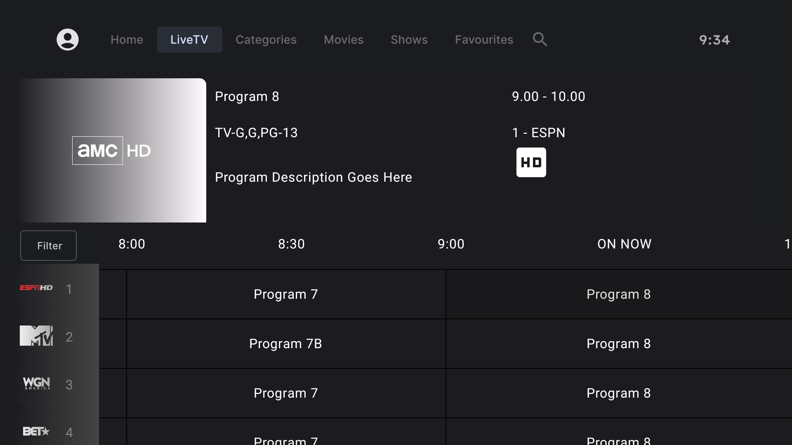
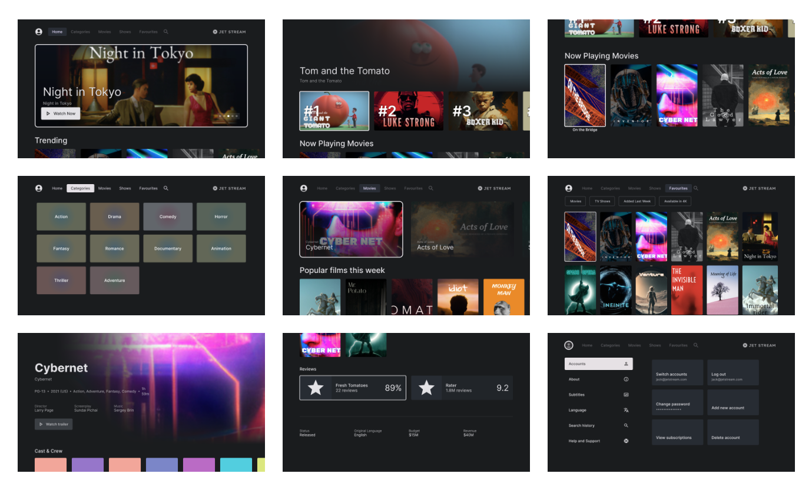

## Compose TV Demo

Used the JetStream demo to add my EPG demo.
Showcasing multiple ways to use and to modify

### Filter Dialog
### Auto Focus 
### OnNow focus



### Dialogs in progress V2
 Bottom view that has menu items, Down key opens the view to have more information

### In Progress 
 Fix minor issues while scrolling EPG
Loading time for EPG and UI Freeze

### JetStream

A sample media streaming app that demonstrates the use of TV Compose with a typical Material app and
real-world architecture.

* Dark themed
* Showcases
  * TabRow
  * Carousel
  * TvLazyRow
  * ImmersiveList
  * TvLazyColumn
  * Tv Material Surface
  * TvVerticalGrid
  * Tv Material Cards
  * Buttons
  * Icon
  * Text
  * Chips
  * ListItem
  * Switch
  * Dialogs

## Screenshots



### Benchmarks

The `benchmarks` module contains sample tests written using [`Macrobenchmark`](https://developer.android.com/studio/profile/macrobenchmark) library. It also contains the test to generate the baseline profile for JetStream app.

### Baseline profiles

The baseline profile for this app is located at [`jetstream/src/main/baseline-prof.txt`](jetstream/src/main/baseline-prof.txt). It contains rules that enable AOT compilation of the critical user path taken during app launch. To learn more about baseline profiles, read [here](https://developer.android.com/studio/profile/baselineprofiles).

For more details on how to generate & apply baseline profiles, check [this document](baseline-profiles.md).


## License
```
Copyright 2023 Google LLC

Licensed under the Apache License, Version 2.0 (the "License");
you may not use this file except in compliance with the License.
You may obtain a copy of the License at

    https://www.apache.org/licenses/LICENSE-2.0

Unless required by applicable law or agreed to in writing, software
distributed under the License is distributed on an "AS IS" BASIS,
WITHOUT WARRANTIES OR CONDITIONS OF ANY KIND, either express or implied.
See the License for the specific language governing permissions and
limitations under the License.
```
